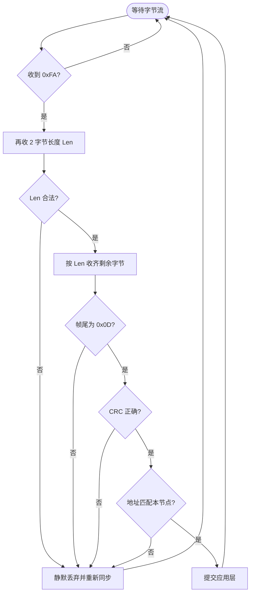
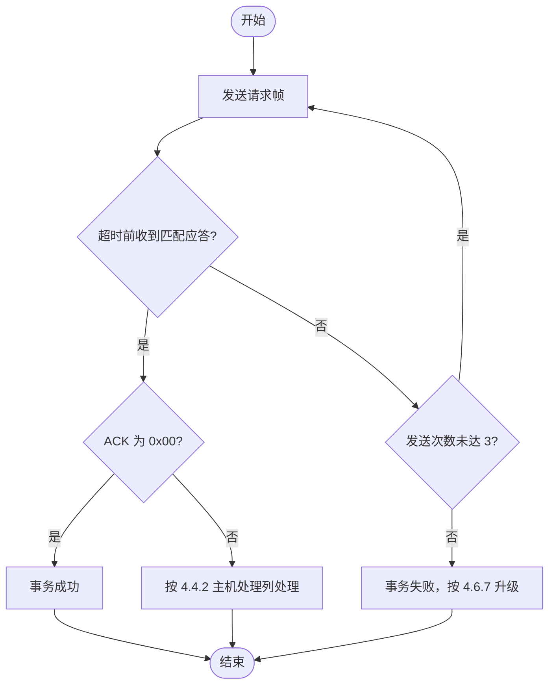
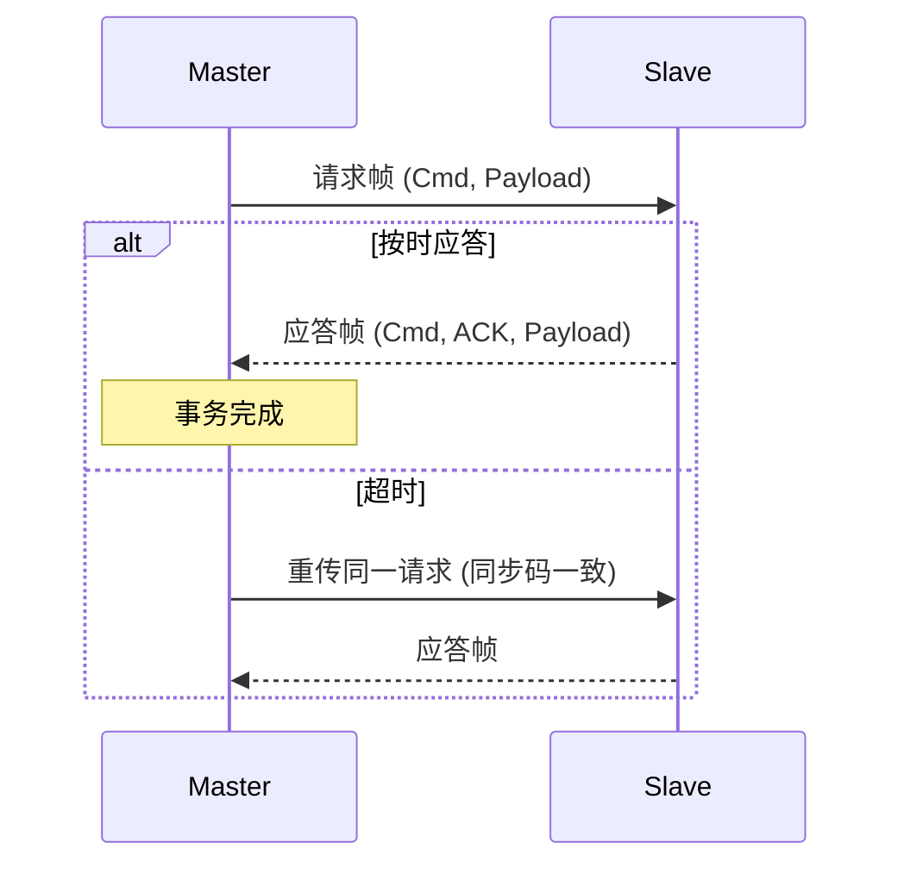
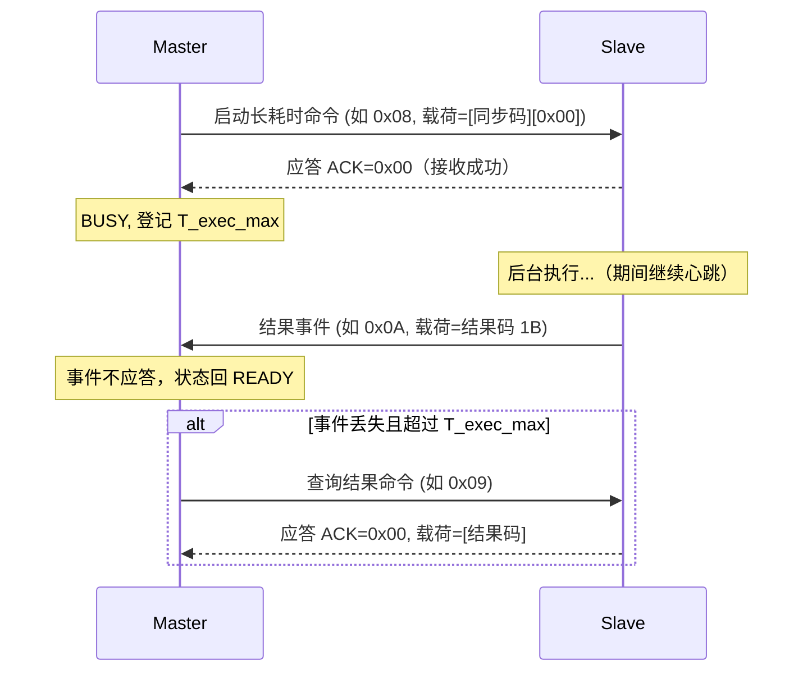
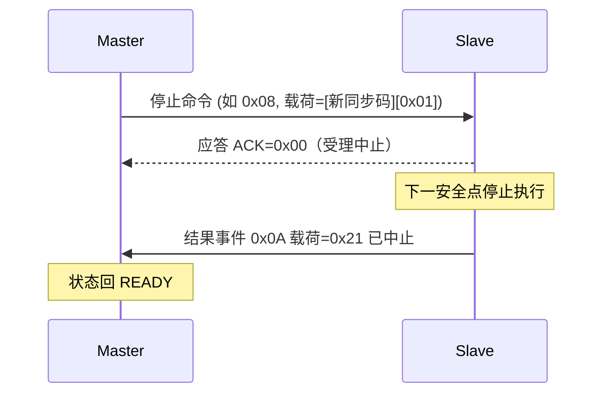
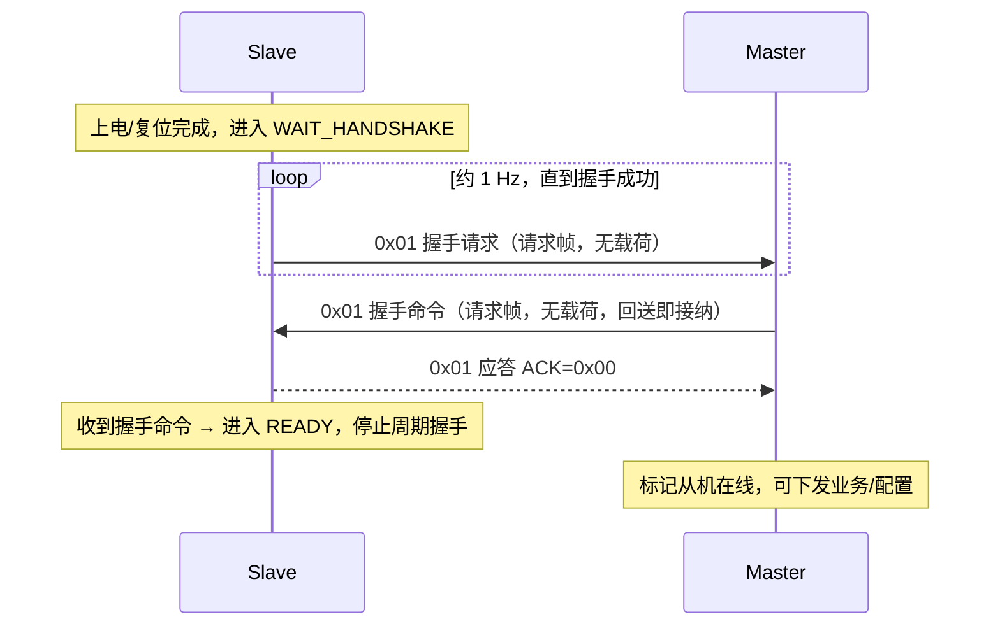
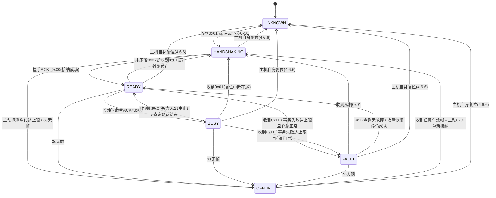
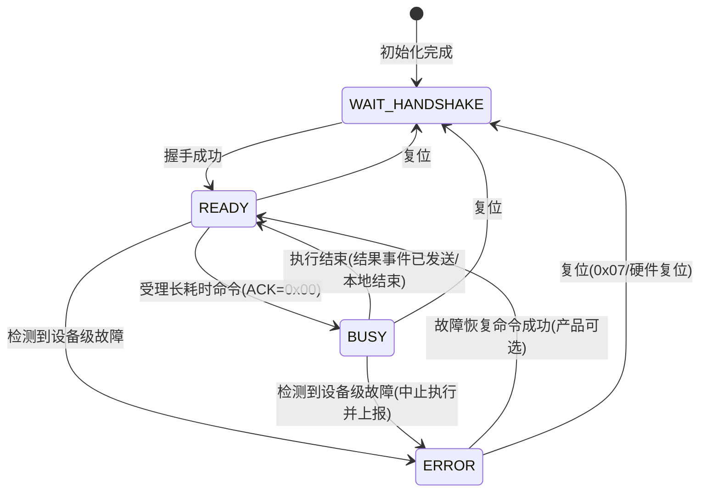

> **本仓库钉扎快照**（非 ECSP 权威原稿）
>
> | 项 | 值 |
> |---|---|
> | 版本 | unversioned-draft |
> | 日期 | 2026-08-25 |
> | 来源 | 设备组工作稿，2026-08-25 拷贝入本仓库 |
>
> 权威原稿属于设备组/公司级标准。本文件仅供本固件实现对照；**产品命令不得修改本文件的通用规则**。本板产品命令见 [loop-impedance-board.md](loop-impedance-board.md)。

# 1 介绍

## 1.1 目的与适用范围

本文件旨在介绍通过串行线路实现的设备组自定义协议，以便所有系统设计人员在其串行线路产品上实现 ECSP（Equipment-group Custom Serial Protocol，设备组自定义串行协议）时能够参考使用，实现采用 ECSP 协议的各类设备之间的互操作性。

本文件定义 ECSP 的通用部分（物理层、数据链路层、应用层通用命令与机制）。**产品/板卡专属命令（命令码 0x30~0xEF）由各产品规范定义**，并在本文件预留的扩展点（命令码区间、时序参数可覆盖项、故障码表等）内生效；产品规范不得修改本文件的通用规则。

## 1.2 协议概述

ECSP 属于 Master-Slave 协议：存在一个主节点（Master），它向某个"从"节点（Slave）发送明确指令并处理其响应。物理层可采用 UART、RS485、RS232 等接口，UART 最为常用。

ECSP 协议栈与 OSI 七层模型的对比：

| 层次 | ISO/OSI Model | ECSP 实现 |
| :-- | :------------ | :--------------- |
| 7 | Application | ECSP 应用层协议 |
| 6 | Presentation | / |
| 5 | Session | / |
| 4 | Transport | / |
| 3 | Network | / |
| 2 | Data Link | ECSP 串行链路协议 |
| 1 | Physical | UART / RS485 / RS232 |

> **分层说明**：与 Modbus RTU 相同，ECSP 采用三层模型（物理层/数据链路层/应用层），OSI 第 3~6 层为空缺，属刻意简化：
> - **无网络层**：单总线、单播寻址，无跨网段路由需求，寻址由数据链路层帧内地址字段完成；
> - **无传输层**：报文短，无需分段重组；可靠性由 CRC 校验 + 应用层超时重发兜底；
> - **无会话层**：本协议的握手、心跳、复位恢复、状态机等机制（见 4.6~4.8）均属应用层协议自身的设计；
> - **无表示层**：数据编码（字节序）作为串行线协议的一部分，归入数据链路层（见 3.1）。

## 1.3 术语与缩写

| 术语         | 说明                                                                                                  |
| :--------- | :-------------------------------------------------------------------------------------------------- |
| ECSP       | Equipment-group Custom Serial Protocol，设备组自定义串行协议                                                   |
| Master     | 主机，发起控制、配置、查询事务，处理从机事件与周期状态，维护对每台从机的观测状态                                                            |
| Slave      | 从机，执行命令、回应答、主动上报事件与周期状态                                                                             |
| 事务         | Master 发起一次请求并收到匹配应答（或重试耗尽）的完整往返；同一时刻总线上仅有一个在途事务                                                    |
| 帧 / PDU    | 协议数据单元，由帧头、长度、产品地址、命令码、板卡地址、应答码/数据载荷、CRC16、帧尾组成                                                     |
| 请求帧        | Master→Slave 的下行帧，从机必须应答                                                                            |
| 应答帧        | Slave→Master 的响应帧，携带应答码                                                                             |
| 事件帧        | Slave→Master 的一次性主动上报（如长耗时命令结果、故障上报），仅发送一次，主机不应答                                                    |
| 周期状态帧      | Slave→Master 的周期性主动上报（如心跳），主机不应答                                                                    |
| 帧类型        | 帧的形态与方向：请求帧 / 应答帧 / 事件帧 / 周期状态帧；由命令类别派生（4.3.1）                                                      |
| 命令类别       | 按语义对命令的划分：查询类 / 设置类 / 动作类 / 事件上报类（单次、周期）/ 特殊（会话建立）；决定同步码与重发策略并派生帧类型（4.3.2）                          |
| 同步码        | 动作类命令载荷首字节的事务标识，用于幂等去重（见 4.5.1）                                                                     |
| 应答码        | 应答帧中表示解析或执行结果的 1 字节代码（见 4.4）                                                                        |
| 长耗时命令      | 先应答"已接收并开始执行"、后台执行完成后以事件上报结果的命令类型（如系统自检、在线升级）                                                       |
| 中止         | Master 主动提前终止一个在途长耗时命令；从机在安全点停止、以结果码 0x21「已中止」收尾并回 READY；区别于系统复位（整体重启）与故障中断（被动）                     |
| T_exec_max | 长耗时命令的最大执行时间，由命令定义声明（见 4.6.2）                                                                       |
| 良构帧        | 帧头/长度/帧尾/CRC/地址全部校验通过的帧                                                                             |
| 坏帧         | 未通过帧级校验的帧（长度非法、帧尾错、CRC 错、接收超时等），接收方静默丢弃                                                             |
| 握手         | Slave 在 WAIT_HANDSHAKE 状态下与 Master 建立会话的三步过程（Slave 请求 → Master 握手命令 → Slave 应答）；握手成功前 Slave 不处理业务命令 |
| 观测状态       | Master 基于协议交互证据推断的 Slave 状态（4.7）                                                                    |
| 内部状态       | Slave 设备内部真实状态（4.8），与观测状态互为镜像、不混用                                                                   |

## 1.4 文档约定

- **必须/禁止**：规范性强制要求，违反即不兼容；
- **应当/不应**：强烈建议，偏离需在实现说明中给出理由；
- **可以/建议**：可选或推荐做法；
- 数值书写：十六进制前缀 `0x`；多字节数值一律小端（见 3.1）；
- 报文示例中的 `[CRC_L] [CRC_H]` 为 CRC16 小端占位；`P` = 产品地址、`B` = 板卡地址，实现时按实算填充。

---

# 2 物理层规范

> 本层对应 OSI 第 1 层。

## 2.1 电气与拓扑

- 电平：TTL 或 RS-485（由具体产品硬件定义）；
- 拓扑：点对点或多从机总线；**同一时刻仅允许一方发送**，半双工调度由本协议的上层规则保证（见 3.6）。

## 2.2 串行通信参数

所有节点必须使用一致参数。推荐默认配置：

| 参数 | 取值 |
| :-- | :-- |
| 波特率 | 115200 bps |
| 数据位 | 8 |
| 校验位 | None |
| 停止位 | 1 |
| 流控 | None |

> 产品若使用非默认波特率，必须在产品规格书中显式声明，且 Master/Slave 保持一致；非默认波特率会改变字符时间，须按 2.3 重新核算相关时序参数。

## 2.3 时序参数总表（物理层部分）

完整时序参数（含通信层）汇总见附录 C。本节定义与物理层直接相关的参数：

| 参数 | 推荐值 | 产品可覆盖 | 说明 |
| :-- | :-- | :--: | :-- |
| 字符时间 T_char | 10/波特率（8N1）≈ 87 µs @115200 | 否 | 派生量 |
| 帧内字节间隔 | 0（连续发送） | 否 | 发送方必须将一帧的字节连续无间隙发出 |
| 帧间静默 | ≥ 2×T_char | 否 | 两帧之间必须保持的静默时间 |
| 接收字节间隙判定 | > 2×T_char 视为帧结束 | 否 | 见 3.5 |
| 从机转向延迟 | ≤ 2 ms | 可以（仅限更小） | 从机收到完整请求帧到开始发送应答的时间上限 |

---

# 3 数据链路层规范

> 本层对应 OSI 第 2 层。

ECSP 串行线协议是一种主从协议。同一时间仅有一个 Master 连接到总线，一个或多个 Slave 也连接到同一串行总线。通信可由 Master 发起，也可由 Slave 发起（事件、周期状态）。Slave 之间不进行任何通信。Master 同一时间仅发起一个在途事务。

ECSP 仅支持单播（unicast）：Master 向单个 Slave 发送请求；该 Slave 处理后返回应答。每个 Slave 以（产品地址, 板卡地址）唯一寻址（见 4.1）。

## 3.1 数据编码

- 所有多字节数值（帧长度、CRC16 及载荷中的多字节数值）均采用 **Little-endian**；
  - 示例：`0x1234` 线上字节序为 `[0x34, 0x12]`；
- 文本类载荷（版本号、序列号）按 ASCII 字节顺序发送，不受端序影响。

## 3.2 帧结构

| 字段 | 帧头 | 长度 | 产品地址 | 命令码 | 板卡地址 | 应答码/数据载荷 | CRC16 | 帧尾 |
| :-: | :--: | :-: | :--: | :-: | :--: | :--: | :---: | :--: |
| 长度 | 1B | 2B | 1B | 1B | 1B | N B | 2B | 1B |
| 取值 | 0xFA | — | — | — | — | — | — | 0x0D |

1. **帧头（Frame Header）**：1 字节，固定值 0xFA；
2. **帧长度（Frame Length）**：2 字节，小端，表示从帧头到帧尾（均含）的整帧字节数；
3. **产品地址（Product Address）**：1 字节，多板卡同一产品共用同一产品地址（见 4.1）；
4. **命令码（Command Code）**：1 字节，标识功能；通用区与应用区划分见 4.2；
5. **板卡地址（Board Address）**：1 字节，在同一产品总线内唯一标识一块板卡（见 4.1）；
6. **应答码/数据载荷**：
   - **应答帧**：板卡地址后首字节固定为**应答码**，其后为结果数据载荷；
   - **非应答帧**：板卡地址后直接为数据载荷；
   - **数据载荷可为空**
1. **CRC16**：2 字节，小端，CRC16-Modbus，计算范围自长度字段首字节起至数据载荷末字节止（含），不含帧头、CRC 自身、帧尾（见 3.4）；
2. **帧尾（Frame Tail）**：1 字节，固定值 0x0D。

最小帧长：请求帧 / 事件帧 / 周期状态帧 = 9 字节（0x0009）；应答帧 = 10 字节（0x000A）。最大帧长见 3.3。

## 3.3 帧长限制

- 最小帧长 9 字节（见 3.2）；
- 最大帧长：**默认 65535 字节**（长度字段表达上限）；产品可根据实际情况声明更小的最大帧长值，并在产品规格书中写明。
- 在解析帧时若长度字段值超出产品声明的帧长范围时按坏帧处理（见 3.5）。

## 3.4 CRC 校验

| 参数 | 取值 |
| :-- | :-- |
| 算法 | CRC16-Modbus |
| 宽度 | 16 bit |
| 多项式 | 0x8005（反射 0xA001） |
| 初始值 | 0xFFFF |
| 结果异或 | 0x0000 |
| 输入反转 | True |
| 输出反转 | True |
| 计算范围 | 长度字段首字节起，至数据载荷末字节止（含），不含帧头、CRC、帧尾 |

接收方对整帧校验：CRC 错误 → 坏帧，静默丢弃（3.5）。测试向量见附录 A。

## 3.5 接收解析与坏帧规则

### 3.5.1 解析流程



### 3.5.2 坏帧与静默丢弃规则

| 情形 | 行为 |
| :-- | :-- |
| 长度字段非法（< 9 或 > 产品声明最大帧长） | 静默丢弃 |
| 帧尾 ≠ 0x0D | 静默丢弃 |
| CRC 错误 | 静默丢弃 |
| 接收超时（字节间隙 > 2×T_char 后帧仍不完整） | 静默丢弃 |
| 良构帧但（产品地址, 板卡地址）非本节点 | 静默丢弃（该帧发给其他节点） |

- 坏帧一律**不应答**，由发送方超时重发兜底（4.6.1）；
- 帧头不参与"坏帧判定"：接收机以 0xFA 重新同步，非 0xFA 字节直接丢弃；
- 良构且地址匹配的帧提交应用层：请求帧必须应答（4.4 规则 1）；周期状态帧、事件帧不应答。

## 3.6 发送调度与半双工

- 同一时刻总线上仅一方发送；
- Master 同一时刻仅一个在途事务：上一事务完成（收到应答/重试耗尽）后才可发起下一请求；
- Slave 仅在以下时机发送：应答请求、上报事件（单次）、发送周期状态；
- 相邻两帧之间保持 ≥ 2×T_char 的静默间隔；
- 从机收到完整请求帧后，应在转向延迟（≤ 2 ms）内开始发送应答。

---

# 4 应用层规范

> 本层对应 OSI 第 7 层。握手、心跳、超时重传、状态机等"会话/可靠性"机制均属应用层协议自身的设计（与 Modbus RTU 一致，不单独设会话层/传输层），见 4.6~4.8。

## 4.1 地址空间

| 字段 | 取值 | 说明 |
| :-- | :-- | :-- |
| 产品地址 | 1 字节 | 标识产品线；同一产品的多块板卡共用同一产品地址 |
| 板卡地址 | 1 字节 | 在同一产品总线内唯一标识一块板卡 |

- 0x00 与 0xFF 为**保留值**，不得分配给节点；合法地址为 0x01~0xFE（每地址空间最多 254 个有效地址）；
- Slave 的（产品地址, 板卡地址）二元组必须唯一；
- 寻址匹配规则：帧内产品地址与板卡地址**同时**匹配本节点才处理（3.5）。

## 4.2 命令码一览

命令码空间划分：

| 区间 | 用途 |
| :-- | :-- |
| 0x00 | 保留 |
| 0x01~0x2F | **通用命令**（本规范定义，所有设备应支持表内已定义项） |
| 0x30~0xEF | 产品/设备组应用命令（产品规范定义） |
| 0xF0~0xFE | 保留（厂商扩展/调试） |
| 0xFF | 保留 |

通用命令一览：

|    命令码    | 功能       |      发起方       |   命令类别    |
| :-------: | :------- | :------------: | :-------: |
|   0x01    | 握手       | Master / Slave | 特殊（会话建立）  |
|   0x02    | 获取软件版本   |     Master     |    查询类    |
|   0x03    | 设置硬件版本   |     Master     |    设置类    |
|   0x04    | 获取硬件版本   |     Master     |    查询类    |
|   0x05    | 设置序列号    |     Master     |    设置类    |
|   0x06    | 查询序列号    |     Master     |    查询类    |
|   0x07    | 系统复位     |     Master     |    动作类    |
|   0x08    | 控制系统自检   |     Master     | 动作类（长耗时）  |
|   0x09    | 查询系统自检结果 |     Master     |    查询类    |
|   0x0A    | 系统自检结果上报 |     Slave      | 事件上报类（单次） |
|   0x0B    | 设置低功耗模式  |     Master     |    设置类    |
|   0x0C    | 在线升级     |     Master     | 动作类（长耗时）  |
|   0x0D    | 查询在线升级结果 |     Master     |    查询类    |
|   0x0E    | 在线升级结果上报 |     Slave      | 事件上报类（单次） |
|   0x0F    | 控制上传模式   |     Master     |    设置类    |
|   0x10    | 心跳周期上传   |     Slave      | 事件上报类（周期） |
|   0x11    | 故障上报     |     Slave      | 事件上报类（单次） |
|   0x12    | 查询故障状态   |     Master     |    查询类    |
| 0x13~0x2F | 保留       |       —        |     —     |

## 4.3 命令类别与帧类型

命令类别是命令的语义属性（每命令唯一）；**帧类型由命令类别派生**，命令表中只保留命令类别一列（见 4.2）。

### 4.3.1 帧类型（帧形态 + 方向，规范性）

帧是协议线上的最小传输单元，按方向与事务匹配方式分为四种帧类型：

| 帧类型 | 方向 | 板卡地址后首字节 | 是否应答 |
| :-- | :-- | :-- | :-- |
| 请求帧 | Master → Slave | 数据载荷首字节 | Slave 回应答帧 |
| 应答帧 | Slave → Master | 应答码 | 否（事务完成） |
| 事件帧 | Slave → Master | 数据载荷首字节 | 否（单次发送，主机不应答） |
| 周期状态帧 | Slave → Master | 数据载荷首字节 | 否（周期发送，主机不应答） |

最小帧长：请求/事件/周期状态帧 = 9 字节；应答帧 = 10 字节（含应答码）。

**帧类型判定规则**（无 SN 字段后的方向判据）：

1. Slave 收到的帧一律是**请求帧**（Master 只发送请求帧）；
2. Master 收到帧时：若**存在在途事务**，且帧的**命令码 == 在途请求的命令码**且**板卡地址匹配**，则按**应答帧**解析（第 6 字节为应答码）；否则按命令码查 4.2 表的命令类别判定为事件帧或周期状态帧；
3. **规范性约束：命令码的（方向, 帧类型）必须全局唯一**——一个命令码要么是 Master 请求命令，要么是 Slave 事件/周期命令，不能身兼两职（保证规则 2 无歧义）。该约束由"每个命令码的命令类别唯一"自然保证；**0x01 握手是唯一例外**：其请求形态双向存在，应答形态由规则 2 的在途事务判据区分；
4. 事件帧与周期状态帧结构相同、均不应答，区别仅在于发送时机（单次/周期）。

### 4.3.2 命令类别（语义，决定同步码、重发策略与帧类型）

| 命令类别      |      发起方       | 使用的帧类型       |    同步码    | 重发安全          | 通用命令示例                        |
| :-------- | :------------: | :----------- | :-------: | :------------ | :---------------------------- |
| 查询类       |     Master     | 请求帧 + 应答帧    |     无     | 安全（幂等）        | 0x02/0x04/0x06/0x09/0x0D/0x12 |
| 设置类       |     Master     | 请求帧 + 应答帧    |     无     | 安全（幂等写）       | 0x03/0x05/0x0B/0x0F           |
| 动作类       |     Master     | 请求帧 + 应答帧    | **载荷首字节** | 靠同步码去重（4.5.1） | 0x07/0x08/0x0C 及产品动作命令        |
| 事件上报类（单次） |     Slave      | 事件帧          |     无     | 单次发送、不应答      | 0x0A/0x0E/0x11                |
| 事件上报类（周期） |     Slave      | 周期状态帧        |     无     | 周期发送、不应答      | 0x10 及产品周期上传                  |
| 特殊（会话建立）  | Master / Slave | 请求帧（双向）+ 应答帧 |     无     | —             | 0x01 握手                       |

## 4.4 应答码规范

### 4.4.1 规则 1：何时应答

| 情形 | 从机行为 |
| :-- | :-- |
| 坏帧（长度非法/帧尾错/CRC 错/接收超时） | **静默丢弃，不应答**，主机超时重发兜底 |
| 良构帧但地址不匹配本节点 | **静默丢弃**（发给其他节点的帧） |
| 良构帧且地址匹配的请求帧 | **必须应答**，应答码表达应用层结果 |

Master 收到坏帧静默丢弃（继续等待在途事务应答或超时）；Master 收到事件帧/周期状态帧**不应答**。

### 4.4.2 规则 2：应答码分类表

| 类别             |     码     | 含义       | 从机何时发送                          | 主机处理                                    |
| :------------- | :-------: | :------- | :------------------------------ | :-------------------------------------- |
| 成功             |   0x00    | 操作成功     | 命令执行成功；长耗时命令已受理开始执行             | 事务完成；长耗时登记在途（含 T_exec_max）              |
| 请求内容错误（缺陷，不重试） |   0x01    | 未指定错误    | 无法归类的失败兜底                       | 记录日志，报告缺陷，**不重试**                       |
|                |   0x02    | 数据载荷长度错误 | 载荷长度与命令定义不符（如命令定义 2 字节、实收 4 字节） | 同上                                      |
|                |   0x03    | 数据载荷参数无效 | 长度正确但内容非法：越界/格式/取值错             | 同上                                      |
|                |   0x04    | 不支持的命令操作 | 命令码未定义或本板不支持                    | 同上                                      |
|                | 0x05~0x0F | 保留       | —                               | —                                       |
| 状态拒绝（按码恢复）     |   0x10    | 未握手拒绝    | WAIT_HANDSHAKE 状态下收到非 0x01 命令   | 先完成握手（4.6.3）再重发                         |
|                |   0x11    | 操作正忙     | BUSY 状态下收到新长耗时/动作命令             | 等待结果事件，或 T_exec_max 超时后查询兜底             |
|                |   0x12    | 模式异常     | 当前工作模式不允许该操作                    | 先切换模式（产品命令）再重试                          |
|                |   0x13    | 操作无效     | 前置条件/上下文不满足（区别于参数无效）            | 检查并满足前置条件后重试                            |
|                |   0x14    | 模块锁定     | 涉及模块被锁定                         | 先解锁（产品命令）再重试                            |
|                |   0x15    | 系统锁定     | 整机锁定/安全锁存                       | 停止自动重试，上报用户/走安全流程                       |
|                | 0x16~0x1F | 保留       | —                               | —                                       |
| 执行/内部错误        |   0x20    | 操作失败     | 执行阶段非预期失败（含硬件类故障）               | 按产品安全策略处理；可查询详情；设备级故障经 0x11/0x12 故障通道上报 |
|                |   0x21    | 已中止      | 长耗时命令被主机主动中止（控制码 0x01）          | 结束中止流程，状态回 READY                        |
|                | 0x22~0x2F | 产品扩展     | 产品定义                            | 产品定义                                    |

### 4.4.3 规则 3：错误详情载荷

应答码固定 1 字节，表达"结果 + 类别"；需要精确原因的，由命令定义在应答帧的数据载荷中追加错误详情。默认无

### 4.4.4 规则 4：应答码空间独立

应答码与命令码是**不同字段、不同空间**，数值允许重叠（如应答码 0x11"操作正忙"与命令码 0x11"故障上报"互不相干）。不得将二者混用。

## 4.5 命令设计约定

### 4.5.1 同步码与幂等（动作类）

动作类命令（有副作用）重复执行可能产生危害（例：主机发送启动脉冲 → 从机已实际执行，但应答超时 → 主机重发 → 从机再次执行，导致执行两次）。

约定：

1. 动作类命令的**数据载荷首字节为 1 字节同步码**（事务标识），随命令载荷定义声明；
2. 同步码由 Master 生成：为每台从机维护独立计数器，0~255 递增回绕；
3. **重传必须与初发使用相同同步码**（4.6.1）；
4. Slave 以（命令码, 同步码）为键缓存最近应答：重复送达时**直接重发缓存应答，不重复执行**；缓存条目数产品可配置（≥ 3，与重传上限匹配）；复位后清空缓存；
5. 查询类/设置类无同步码：查询无副作用，设置重复无害；
6. **长耗时命令**载荷为 **[同步码][控制码]**：控制码 0x00 = 启动、0x01 = 停止（见 4.6.2）；停止请求必须使用**新同步码**（独立事务，不得复用启动同步码，否则会被幂等缓存拦截）；
7. 长耗时命令**结束时清除**该命令码的幂等缓存条目（防止迟到的启动重传命中陈旧缓存、掩盖中止事实）。

### 4.5.2 事件帧载荷约定

| 事件类别 | 数据载荷 | 说明 |
| :-- | :-- | :-- |
| 长耗时命令执行结果通知 | 固定 1 字节 | 执行结果，取值同应答码（0x00 成功） |
| 故障上报 | 1 字节故障码 + 可选数据 | 故障码 0x00 = 无故障（仅用于 0x12 查询应答，上报时恒为非 0x00）；故障码表由产品定义 |
| 其它主动上报事件 | 长度与结构不定 | 由具体命令码定义 |

### 4.5.3 长耗时命令配套要求

每个长耗时命令都必须有一个对应的**查询结果命令**（0x08→0x09、0x0C→0x0D），用于结果事件丢失时的兜底（4.6.2）。

## 4.6 通信机制与流程

### 4.6.1 请求–应答与超时重传

| 参数 | 推荐值 | 说明 |
| :-- | :-- | :-- |
| 应答超时 | 100 ms | 核算公式见下；产品可上调 |
| 最大发送次数 | 3（1 次初发 + 2 次重传） | |
| 重传同步码 | 与初发相同 | 动作类命令（4.5.1） |

应答超时核算公式：`T_resp = 2×T_frame(max) + T_turn(≤2ms) + T_proc + 余量`。115200 bps、最大帧长 ≤ 512 字节时，最坏往返约 95 ms，100 ms 约有 1 倍余量。**若产品最大帧长的单向传输时间接近或超过 100 ms（如低波特率、大帧），必须按公式上调**。

应答帧匹配规则：应答帧无事务标识，因总线上**同一时刻仅一个在途事务**，Master 以"命令码 == 在途请求命令码 且 板卡地址匹配"完成匹配（4.3.1 规则 2）。





### 4.6.2 长耗时命令机制

原则：

1. Slave **先应答、后执行**，不得等操作全部完成再回第一次应答；
2. 第一次应答 ACK=0x00 表示接收成功并开始执行；若拒绝，则回相应错误码且**无**后续结果事件；
3. 操作结束后，Slave 必须发送独立命令码（如 0x0A/0x0E）来进行结果事件的上报；
4. 结果事件数据载荷为 1 字节执行结果（同应答码，0x00 成功）；
5. 每个长耗时命令必须配查询结果命令（4.5.3）。

**执行超时（T_exec_max）**：

- 每个长耗时命令在命令定义中声明最大执行时间 T_exec_max（如自检 ≤ 2 s、升级 ≤ 60 s，产品可覆盖）；
- Master 受理后登记在途（命令码, 同步码, 起始时间, T_exec_max），在 BUSY 状态等待结果事件；
- **超过 T_exec_max 未收到结果事件** → Master 下发查询结果命令（0x09/0x0D）：
  - 查询应答"仍在执行" → 重新计时继续等待；
  - 查询应答"已结束/失败" → 按结果处理，状态回 READY；
  - 查询本身超时 → 按 4.6.7 通信失败升级处理；
- Slave 义务：BUSY 期间**仍发心跳**（防止主机误判离线）；超过 T_exec_max 从机必须自行结束并上报结果，不得无限执行。

**中止（长耗时命令的主动停止）**：

- 长耗时命令的载荷统一为：`0x00 = 启动`，`0x01 = 停止`（中止在途执行）；是否支持停止由命令定义声明（见下方"中止策略"）；
- 停止请求**必须使用新同步码**（独立事务）：若复用启动同步码，从机幂等缓存（命令码, 同步码）会命中"已受理"条目而忽略停止；
- **停止事务为二段式**（与长耗时机制统一）：
  1. Master 下发 [新同步码][0x01] → Slave 应答 ACK=0x00（已受理中止，仍处 BUSY）；
  2. Slave 在下一安全检查点停止执行，发送**原命令的结果事件**（0x0A/0x0E），载荷 = **0x21 已中止**；BUSY → READY；
  3. 中止过程中查询结果（0x09/0x0D）：执行中 → 0x11；已中止 → 0x21；
- **无在途执行**时收到停止控制码 → 应答 **0x13 操作无效**；Master 对未定义停止控制码（不可中止）的命令不应下发停止；
- **失聪窗口**：原子写/擦除期间从机无法响应（收不到帧），Master 不应重发停止/查询（防重传雪崩），等待结果事件或 T_exec_max 到期后再查询；
- **中止后状态**：从机必须处于可明确恢复状态——旧数据保持可运行，或明确进入"数据无效、需重新写入/升级"状态；具体 Flash 策略（双 Bank/备份区/回滚/校验）由产品规范定义（附录 E 待处理事项）。

**中止策略（命令定义声明）**：

| 档位         | 声明       | 行为                     | 典型命令        |
| :--------- | :------- | :--------------------- | :---------- |
| 档 1 可随时中止  | 定义停止控制码  | 任何时刻收到停止即在下个安全点停止      | 自检 0x08、校准类 |
| 档 2 仅块间可中止 | 定义停止控制码  | 原子写/擦除窗口内从机失聪，停止只在块间生效 | 升级 0x0C     |
| 档 3 不可中止   | 不定义停止控制码 | 收到停止 → 0x03 参数无效       | 同步原子写类      |



**中止时序**：



### 4.6.3 上电握手流程（三步握手）

握手成功前，Slave 仅处理握手（0x01）；其他命令（若帧良构）应答 **0x10 未握手拒绝**。



**主机应答即接纳**：Master 收到从机的 0x01 握手请求后，回送 0x01 握手命令（无载荷）即表示接纳；**不回应即为拒绝**（隐式拒绝，如不在白名单的从机），从机保持 WAIT_HANDSHAKE 继续 1 Hz 请求。

**主机主动握手**（主机复位后，见 4.6.6）：Master 主动下发 0x01 握手命令（无载荷）；**READY 状态的从机收到握手命令 → 应答 ACK=0x00 并保持 READY**（视为主机重新接纳）；重传规则同 4.6.1。

**异常处理**：

| 场景 | 处理 |
| :-- | :-- |
| Master 握手命令丢失 | Slave 继续 1 Hz 握手请求 |
| Slave 应答丢失 | Master 按 4.6.1 重传握手命令 |
| 主动握手重传达上限 | Master 标记 OFFLINE，等待再次收到 Slave 的 0x01 或任意帧 |

**报文示例**（`P`=产品地址，`B`=板卡地址；CRC 占位，须实算）：

```text
Slave→Master 握手请求（9B）:
FA 09 00 P 01 B [CRC_L] [CRC_H] 0D

Master→Slave 握手命令（9B，无载荷）:
FA 09 00 P 01 B [CRC_L] [CRC_H] 0D

Slave→Master 握手应答（10B）:
FA 0A 00 P 01 B 00 [CRC_L] [CRC_H] 0D
```

> 握手请求与握手命令字节相同，仅方向相反，按 4.3.1 规则区分。

### 4.6.4 复位检测与恢复流程

- 从机复位后进入 WAIT_HANDSHAKE，以约 1 Hz 发送 0x01 握手请求，直至握手成功（4.6.3）；
- 主机据此识别复位：已 READY 的从机再次收到 0x01，即表明其发生过复位（含复位重连场景）。

**复位性质判定**（复位原因不上报，主机按上下文推断）：

| 场景 | 判定 | 处理 |
| :-- | :-- | :-- |
| 主机刚下发 0x07 且收到应答，随后收到 0x01 | 预期复位 | 按正常恢复流程重新握手 |
| 已 READY 的从机在未下发 0x07 时收到 0x01 | 意外复位 | 按故障处理：停止相关业务，重新自检/配置安全参数后再恢复 |

**恢复流程**：

1. 标记从机离线/复位，停止对其依赖的业务；
2. 完成握手（4.6.3）；
3. 重新配置安全相关参数；
4. 确认从机 READY 后恢复业务（危险业务恢复前须满足 4.6.6 的启动前提）。

> 从机在长耗时命令（BUSY）执行期间复位时，结果事件不会再到达，主机应取消在途的长耗时命令记录，并向业务层报告执行中断。

### 4.6.5 心跳与掉线检测

- Slave 在 READY/BUSY/ERROR 状态按 1 s 周期发送 **0x10** 心跳（产品可改周期）；
- Master 以 **last_seen**（最近一次收到该从机任意有效帧的时间）作为活性判定：收到该从机的任意帧（心跳、应答、事件、握手请求等）均刷新 last_seen；
- 若超过 **3 s**（3 个心跳周期）未收到该从机任何有效帧，判定通信丢失：

```text
若 now - last_seen > 3000 ms:
    观测状态 = OFFLINE
    停止对其依赖的业务，进入恢复/等待策略（4.6.4/4.6.7）
```

### 4.6.6 主机安全启动

Master 自身复位后不得假设从机状态与复位前一致：

1. 将所有从机标记为 UNKNOWN；
2. 确认从机是否存在：**主动下发 0x01 握手命令**（READY 从机不会主动发 0x01，仅靠等待无法恢复），同时仍可接收从机自发的 0x01；
3. 完成握手后重新配置安全相关参数；
4. 确认关键从机 READY 后，再启动运动/高压等危险业务。

### 4.6.7 通信失败升级策略

当对某从机连续事务失败达到上限：

1. 心跳正常 → 观测状态置 **FAULT**（有活性但不可用，如单边故障）；
2. 心跳亦丢失 → 观测状态 OFFLINE（4.6.5）；
3. 可尝试下发 **0x07 系统复位**（若链路仍偶然可达）；失败不改变状态，仅记录复位尝试标志；
4. 等待 0x01 握手请求或任意帧重新上线，走 4.6.4 恢复流程。

---

## 4.7 主机侧多从机管理

主机以（产品地址, 板卡地址）为键，为每台从机独立维护生命周期与通信上下文。本节定义主机侧多从机管理模型，与 4.8 从机生命周期状态机互为镜像：从机状态机描述设备内部真实状态，主机侧状态机描述主机基于协议交互证据推断的观测状态。

### 4.7.1 从机节点表

| 字段 | 说明 |
| :-- | :-- |
| 节点键 | （产品地址, 板卡地址） |
| 观测状态 | UNKNOWN / HANDSHAKING / READY / BUSY / FAULT / OFFLINE（4.7.2） |
| 曾就绪标志 | 是否曾进入 READY，用于区分首次上线与复位重连 |
| last_seen | 最近一次收到该从机任意有效帧的时间 |
| 在途长耗时命令 | （命令码, 同步码, 起始时间, T_exec_max）；收到结果事件或查询确认结束后清除 |
| 事务失败计数 | 连续失败次数，达到上限触发 4.6.7 升级策略 |
| 下一同步码 | 主机为该从机生成动作类请求的同步码计数器 |
| 最近故障码 | 最近经 0x11/0x12 获知的故障码 |
| 复位尝试标志 | OFFLINE/FAULT 下已尝试下发 0x07 |
| 握手回应记录 | 是否已回握手命令（未回 = 隐式拒绝） |

### 4.7.2 主机侧观测状态机

主机侧状态按**活性 × 可用性**两维定义：

- **活性**（liveness）：是否仍在通信——由 last_seen（任意有效帧刷新）与 3 s 心跳超时判定；
- **可用性**（usability）：是否可执行业务——由握手结果、故障事件、事务结果判定。

| 状态 | 定义 |
| :-- | :-- |
| UNKNOWN | 无任何证据（主机复位后的初始态；可主动 0x01 探测或等待从机 0x01） |
| HANDSHAKING | 正在建立会话（被动响应从机 0x01 或主动探测待应答） |
| READY | 在线且可用 |
| BUSY | 在线，长耗时命令在途（可用性的受限子态） |
| FAULT | **有活性但不可用**：收到 0x11 自报故障，或连续事务失败达上限而心跳正常 |
| OFFLINE | **无活性**：3 s 未收到任何有效帧（链路中断/从机断电/死亡） |



状态转换的触发与动作：

| 转换                         | 触发                                                            | 主机动作                             |
| :------------------------- | :------------------------------------------------------------ | :------------------------------- |
| UNKNOWN → HANDSHAKING      | 收到从机 0x01；或主动下发 0x01                                          | 回握手命令；或启动探测重传                    |
| HANDSHAKING → READY        | 收到握手 ACK=0x00 且接纳                                             | 置曾就绪标志；按 4.6.4 恢复流程重配安全参数        |
| HANDSHAKING → OFFLINE      | 主动探测重传达上限；或 3 s 无任何帧                                          | 标记离线等待                           |
| READY → BUSY               | 长耗时命令（控制码=0x00）ACK=0x00                                       | 登记在途（命令码, 同步码, 起时, T_exec_max）   |
| BUSY → BUSY                | 停止请求（控制码=0x01）ACK=0x00（受理中止）                                  | 保持 BUSY，等待中止结果事件（0x21）           |
| BUSY → READY               | 收到结果事件（0x0A/0x0E，含中止 0x21）；或 T_exec_max 超时后查询 0x09/0x0D 确认已结束 | 清除在途记录，处理结果                      |
| READY → FAULT              | 收到 0x11 故障事件；或连续事务失败达上限且心跳正常                                  | 停止业务，进入恢复/复位尝试                   |
| BUSY → FAULT               | 同上（BUSY 期间）                                                   | 取消在途并报执行中断                       |
| FAULT → HANDSHAKING        | 收到从机 0x01（自复位或 0x07 复位生效）                                     | 走 4.6.4 恢复流程                     |
| FAULT → READY              | 0x12 查询返回无故障；或产品故障恢复命令 ACK=0x00                               | 安全前提满足后恢复业务                      |
| READY → HANDSHAKING        | 未下发 0x07 却收到 0x01（意外复位）                                       | 按 4.6.4 故障处理                     |
| BUSY → HANDSHAKING         | 收到 0x01                                                       | 取消在途、报执行中断、重新握手                  |
| READY/BUSY/FAULT → OFFLINE | 3 s 未收到任何有效帧                                                  | 停止业务；BUSY 时取消在途并报中断              |
| OFFLINE → HANDSHAKING      | 收到该从机任意有效帧（0x01/心跳/事件）                                        | **主动下发 0x01 重新接纳**（链路恢复但从机可能未复位） |
| 任意 → UNKNOWN               | 主机自身复位                                                        | 全部节点重置（4.6.6）                    |

> 说明：OFFLINE 下尝试 0x07 失败不产生新状态，仅置"复位尝试标志"（FAULT 一词专指"有活性但不可用"，不再用于"复位尝试失败"）。

### 4.7.3 状态映射（内部状态 ↔ 观测状态）

| 从机内部状态 | 主机观测状态 | 判定证据 |
| :-- | :-- | :-- |
| WAIT_HANDSHAKE | HANDSHAKING（若 3 s 静默则 OFFLINE） | 收到 0x01 握手请求 |
| READY | READY | 心跳/应答正常 |
| BUSY | BUSY | 在途长耗时命令未收到结果 |
| ERROR | FAULT | 心跳正常 + 收到 0x11 / 业务命令被拒 |
| （链路中断/断电/死亡） | OFFLINE | 3 s 无任何帧 |

---

## 4.8 从机生命周期状态机

| 状态             | 说明                    | 允许的行为                   |
| :------------- | :-------------------- | :---------------------- |
| WAIT_HANDSHAKE | 初始化完成，等待与 Master 握手成功 | 发 0x01（约 1 Hz）；仅处理 0x01 |
| READY          | 正常业务                  | 响应业务命令；心跳；事件上报          |
| BUSY           | 长耗时命令执行中              | 见下表允许矩阵                 |
| ERROR          | 本地设备级故障               | 见下表允许矩阵                 |

各状态允许/拒绝命令矩阵：

| 状态 | 允许 | 拒绝（应答码） |
| :-- | :-- | :-- |
| WAIT_HANDSHAKE | 发 0x01 握手请求（1 Hz）；处理 0x01 | 业务/配置 → **0x10 未握手拒绝** |
| READY | 全部命令；心跳 0x10；事件上报 | — |
| BUSY | 心跳 0x10；查询结果（0x09/0x0D）；只读查询（0x02/0x04/0x06/0x12）；0x07 复位；故障上报 0x11；**同命令码 + 控制码=0x01 停止**（4.6.2） | 同命令码 + 控制码=0x00 新启动 → **0x11 操作正忙**；其他新长耗时/动作类 → **0x11 操作正忙** |
| ERROR | 心跳 0x10；故障上报 0x11；只读查询；0x07 复位；产品定义的故障恢复命令 | 业务/动作 → **0x13 操作无效** |



> 说明：长耗时命令**执行失败不等于 ERROR**——结果事件携带失败码、状态回 READY；ERROR 仅用于设备级故障（硬件异常、自检失败等）。BUSY/ERROR 状态下心跳照发（保证主机活性判定，见 4.6.5）。

---

## 4.9 通用命令详解

示例中 `P`=产品地址、`B`=板卡地址、`SYNC`=同步码；CRC 为占位，实现时必须实算
请求/事件/周期状态帧：帧长 = 9 + 载荷长度；应答帧：帧长 = 10 + 载荷长度（含应答码）。

### 4.9.1 握手（0x01）

- 功能：建立/恢复会话。
- 从机握手请求（请求帧，无载荷）：`FA 09 00 P 01 B [CRC_L] [CRC_H] 0D`
- 主机握手命令（请求帧，无载荷）：`FA 09 00 P 01 B [CRC_L] [CRC_H] 0D`
- 从机应答（ACK=0x00，命令处理成功）：`FA 0A 00 P 01 B 00 [CRC_L] [CRC_H] 0D`

### 4.9.2 获取软件版本（0x02）

- 请求（无载荷）：`FA 09 00 P 02 B [CRC_L] [CRC_H] 0D`
- 成功应答：载荷 7 字节 ASCII，格式 `d.d.d.d`，如 `"1.0.0.0"` → `31 2E 30 2E 30 2E 30`；帧长 10 + 7 = 17 = 0x0011：`FA 11 00 P 02 B 00 31 2E 30 2E 30 2E 30 [CRC_L] [CRC_H] 0D`

### 4.9.3 设置硬件版本（0x03）

- 请求载荷：7 字节 ASCII，格式同 4.9.2；帧长 9 + 7 = 16 = 0x0010：`FA 10 00 P 03 B 30 2E 30 2E 30 2E 30 [CRC_L] [CRC_H] 0D`
- 成功应答：`FA 0A 00 P 03 B 00 [CRC_L] [CRC_H] 0D`

### 4.9.4 获取硬件版本（0x04）

同 4.9.2，命令码改为 0x04；成功应答帧长 0x0011，载荷 7 字节版本字符串。

### 4.9.5 设置序列号（0x05）

- 请求载荷：12 字节 ASCII，格式 `SN` + 10 位数字；帧长 9 + 12 = 21 = 0x0015：`FA 15 00 P 05 B 53 4E 30 30 30 30 30 30 30 30 30 30 [CRC_L] [CRC_H] 0D`
- 成功应答：`FA 0A 00 P 05 B 00 [CRC_L] [CRC_H] 0D`

### 4.9.6 查询序列号（0x06）

- 请求：`FA 09 00 P 06 B [CRC_L] [CRC_H] 0D`
- 成功应答：帧长 10 + 12 = 22 = 0x0016：`FA 16 00 P 06 B 00 53 4E 30 30 30 30 30 30 30 30 30 30 [CRC_L] [CRC_H] 0D`

### 4.9.7 系统复位（0x07）

- 动作类，载荷 = [同步码]；帧长 9 + 1 = 10 = 0x000A：`FA 0A 00 P 07 B SYNC [CRC_L] [CRC_H] 0D`
- Slave 先应答后复位（ACK=0x00 → 立即执行复位）；复位后进入 WAIT_HANDSHAKE（4.6.4）；
- 成功应答：`FA 0A 00 P 07 B 00 [CRC_L] [CRC_H] 0D`。

### 4.9.8 控制系统自检（0x08）

- 动作类（长耗时），载荷 = [同步码][控制码]（0x00 启动 / 0x01 停止）：`FA 0B 00 P 08 B SYNC CTRL [CRC_L] [CRC_H] 0D`
- 立即应答：接收成功 ACK=0x00（进入 BUSY，声明 T_exec_max，推荐 ≤ 2 s）；拒绝为相应错误码且**无** 0x0A 事件；
- 完成后 Slave 发送 0x0A 自检结果上报（单次事件）；
- **中止**：本命令声明**档 1 可随时中止**（见 4.6.2）。

### 4.9.9 查询系统自检结果（0x09）

- 请求（无载荷）：`FA 09 00 P 09 B [CRC_L] [CRC_H] 0D`
- 应答：ACK=0x00（查询本身成功），载荷 = [结果码] 1 字节：
  - 0x00 = 已完成且成功；
  - 0x11 = 仍在执行（主机重新计时，继续等待 0x0A）；
  - 0x21 = 已中止（见 4.6.2）；
  - 其他 = 已结束，取值同应答码（失败原因）。

### 4.9.10 系统自检结果上报（0x0A）

- 事件帧，单次发送，主机不应答；
- 载荷 = [结果码] 1 字节（同应答码，0x00 成功；中止时为 0x21 已中止）；帧长 9 + 1 = 10 = 0x000A：`FA 0A 00 P 0A B RESULT [CRC_L] [CRC_H] 0D`

### 4.9.11 设置低功耗模式（0x0B）

- 设置类，载荷 1 字节：
    - 0x00：退出低功耗模式进入正常模式
    - 0x01：进入低功耗模式
- 请求：`FA 0A 00 P 0B B MODE [CRC_L] [CRC_H] 0D`
- 成功应答：`FA 0A 00 P 0B B 00 [CRC_L] [CRC_H] 0D`；
- **低功耗模式下的从机行为（心跳/应答/上报）与唤醒方式尚未定义，见附录 C 待处理事项**。

### 4.9.12 在线升级（0x0C）

- 动作类（长耗时），载荷 = [同步码][控制码]（0x00 启动 / 0x01 停止）：`FA 0B 00 P 0C B SYNC CTRL [CRC_L] [CRC_H] 0D`
- 立即应答：ACK=0x00 表示接收成功并进入升级流程（进入 BUSY，声明 T_exec_max）；错误码则无 0x0E 事件；
- 升级结束：Slave 发送 0x0E 在线升级结果上报（单次事件）；
- **中止**：本命令声明**档 2 仅块间可中止**——原子擦写窗口内从机失聪，停止帧只在数据块之间生效（见 4.6.2）；
- 具体升级数据通道（XMODEM/自定义分包等）由产品规范定义，本文件仅规定会话级控制语义。

### 4.9.13 查询在线升级结果（0x0D）

- 请求（无载荷）：`FA 09 00 P 0D B [CRC_L] [CRC_H] 0D`
- 应答：ACK=0x00，载荷 = [结果码]，取值语义同 4.9.9（0x00 成功 / 0x11 执行中 / 0x21 已中止 / 其他失败原因）。

### 4.9.14 在线升级结果上报（0x0E）

- 事件帧，单次发送，主机不应答；
- 载荷 = [结果码] 1 字节（同应答码；中止时为 0x21 已中止）；帧长 10 = 0x000A：`FA 0A 00 P 0E B RESULT [CRC_L] [CRC_H] 0D`

### 4.9.15 控制上传模式（0x0F）

- 设置类，载荷 1 字节：
    - 0x00：关闭主动上传
    - 0x01：开启主动上传
- 请求：`FA 0A 00 P 0F B CTRL [CRC_L] [CRC_H] 0D`
- 成功应答：`FA 0A 00 P 0F B 00 [CRC_L] [CRC_H] 0D`。

### 4.9.16 心跳周期上报（0x10）

- Slave → Master，周期状态帧（1 s），主机不应答：`FA 09 00 P 10 B [CRC_L] [CRC_H] 0D`
- Master 掉线判定见 4.6.5。

### 4.9.17 故障上报（0x11）

- 事件帧，单次发送（进入 ERROR 时即发），主机不应答；
- 载荷 = [故障码] 1 字节 + 可选数据；**故障码 0x00 = 无故障**（仅用于 0x12 查询应答，上报时恒为非 0x00）；故障码表由产品定义；帧长 ≥ 10：`FA 0A 00 P 11 B FAULT [CRC_L] [CRC_H] 0D`
- 主机处理：观测状态置 FAULT（4.7.2），停止业务；可用 0x12 查询确认。

### 4.9.18 查询故障状态（0x12）

- 请求（无载荷）：`FA 09 00 P 12 B [CRC_L] [CRC_H] 0D`
- 应答：ACK=0x00，载荷 = [故障码] + 可选数据（**结构与 0x11 完全一致**，产品可扩展详情）：
  - 0x00 = 无故障（无可选数据）；
  - 非 0x00 = 当前故障码；
- 主机用途：故障事件丢失后的兜底确认；FAULT → READY 的判据之一（4.7.2）。

---

# 附录 A：帧示例速查表

| 命令 | 形态 | 字节序列（`P`/`B`/`SYNC` 为占位） |
| :-- | :-- | :-- |
| 0x01 握手 | 请求（无载荷，9B） | `FA 09 00 P 01 B CRC 0D` |
| 0x01 握手命令 | 请求（无载荷，9B） | `FA 09 00 P 01 B CRC 0D` |
| 0x01 握手 | 应答（10B） | `FA 0A 00 P 01 B 00 CRC 0D` |
| 0x02/0x04/0x06/0x09/0x0D/0x12 查询类 | 请求（无载荷，9B） | `FA 09 00 P XX B CRC 0D` |
| 0x02/0x04 版本查询 | 应答（17B） | `FA 11 00 P XX B 00 [7B ASCII] CRC 0D` |
| 0x03 设置硬件版本 | 请求（16B） | `FA 10 00 P 03 B [7B ASCII] CRC 0D` |
| 0x05 设置序列号 | 请求（21B） | `FA 15 00 P 05 B [12B ASCII] CRC 0D` |
| 0x06 查询序列号 | 应答（22B） | `FA 16 00 P 06 B 00 [12B ASCII] CRC 0D` |
| 0x07 复位 | 请求（10B） | `FA 0A 00 P 07 B SYNC CRC 0D` |
| 0x08 自检 | 请求（11B） | `FA 0B 00 P 08 B SYNC CTRL CRC 0D` |
| 0x08/0x0C 停止 | 请求（11B） | `FA 0B 00 P XX B SYNC 01 CRC 0D`（新同步码，CTRL=0x01） |
| 0x09/0x0D 查询结果 | 应答（11B） | `FA 0B 00 P XX B 00 [结果码] CRC 0D` |
| 0x0A/0x0E 结果上报 | 事件（10B，单次，不应答） | `FA 0A 00 P XX B [结果码] CRC 0D` |
| 0x0B 低功耗 | 请求（10B） | `FA 0A 00 P 0B B [0x00/0x01] CRC 0D` |
| 0x0C 升级 | 请求（11B） | `FA 0B 00 P 0C B SYNC CTRL CRC 0D` |
| 0x0F 上传模式 | 请求（10B） | `FA 0A 00 P 0F B [0x00/0x01] CRC 0D` |
| 0x10 心跳 | 周期状态（9B，不应答） | `FA 09 00 P 10 B CRC 0D` |
| 0x11 故障上报 | 事件（≥10B，单次，不应答） | `FA 0A 00 P 11 B [故障码] [可选数据] CRC 0D` |
| 0x12 查询故障状态 | 应答（≥11B） | `FA 0B 00 P 12 B 00 [故障码] [可选数据] CRC 0D` |

# 附录 B：时序参数总表

| 参数               | 推荐值                      |  产品可覆盖   |
| :--------------- | :----------------------- | :------: |
| 字符时间 T_char      | 10/波特率（≈87 µs @115200）   | 否（随波特率）  |
| 帧内字节间隔           | 0（连续发送）                  |    否     |
| 帧间静默             | ≥ 2×T_char               |    否     |
| 接收字节间隙判定         | > 2×T_char 视为帧结束         |    否     |
| 从机转向延迟           | ≤ 2 ms                   |   仅限更小   |
| 应答超时             | 100 ms（公式核算，可上调）         |    可以    |
| 最大发送次数           | 3（1 初发 + 2 重传）           |    否     |
| 心跳周期             | 1 s                      |    可以    |
| 掉线判定             | 3 s（3 个心跳周期）             | 可以（随心跳）  |
| 握手请求周期           | 1 s                      |    可以    |
| 长耗时命令 T_exec_max | 命令定义声明（自检 ≤2 s、升级 ≤60 s） |    可以    |
| 幂等缓存条目           | ≥ 3                      |    可以    |
| 最大帧长             | 65535 字节                 | 可以（声明更小） |


# 附录 C：待处理事项与设计说明

| #   | 事项          | 现状                                 | 后续选项                           |
| :-- | :---------- | :--------------------------------- | :----------------------------- |
| 1   | 事件帧可靠性      | 事件单次发送、无应答、无重传；可能丢失                | 如需可靠送达，可后续为事件帧恢复应答和重传机制（需版本协商） |
| 2   | 低功耗语义（0x0B） | 仅定义进入/退出控制码；进入后的心跳/应答/上报行为与唤醒方式未定义 | 由产品规范结合具体硬件定义                  |
